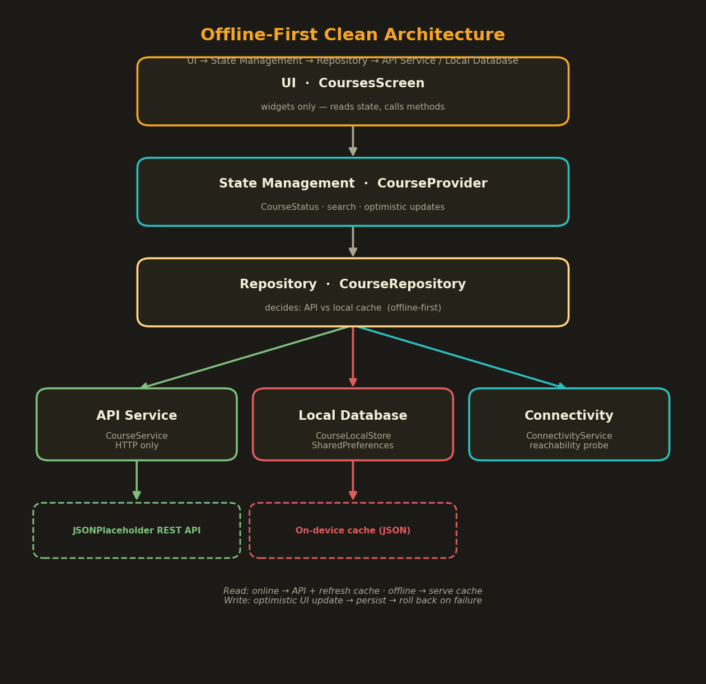

# 📱 Flutter Multi Screen App — Offline Cache & State Management

## 👨‍💻 Student Information
- Name: Abdullah Faisal
- Student_ID: SE 221070

## 🌿 Branch
```
feature/offline-cache-and-state-manangement
```

---

## 📌 Overview
This is the continuation of the **Course CRUD API integration** assignment. The
app is a Flutter Academic Management app (auth → dashboard → courses) with a
premium dark UI.

This extension reworks the Courses feature into a real-world, **offline-first**
module with a clean, layered architecture:

- 💾 **Offline persistence** — fetched courses are cached on-device and shown
  when there is no internet.
- 🧠 **Proper state management** — the screen's `setState` was replaced with a
  dedicated `CourseProvider` (Provider) that models *loading / success / error /
  empty* states explicitly.
- 🧩 **Repository pattern** — a strict `UI → State → Repository → API / Local DB`
  layering, so each layer has a single responsibility.
- ⚡ **Optimistic UI updates** — edit and delete update the UI instantly and roll
  back automatically if the request fails.
- 🔍 **UX polish** — search/filter, pull-to-refresh, offline banner, and distinct
  empty / no-result states.

---

## 🛠️ Tools & Packages Used

| Package | Version | Role in this assignment |
|---------|---------|--------------------------|
| `provider` | ^6.0.5 | **State management** — `CourseProvider` (`ChangeNotifier`) |
| `shared_preferences` | ^2.2.0 | **Local storage** — on-device course cache |
| `http` | ^1.6.0 | REST calls in the API service layer |
| `dart:io` (`InternetAddress`) | SDK | Connectivity / reachability check (no extra plugin) |

> No new dependencies were added — the architecture is built entirely on packages
> already in the project. `SharedPreferences` was chosen for local storage because
> the dataset is small and flat (~20 course objects), which the assignment lists as
> an acceptable "simple case." It needs no native setup, codegen, or migrations.

---

## 🏗️ Architecture

```
UI (CoursesScreen)
   |  reads state - calls intent methods
   v
State Management (CourseProvider : ChangeNotifier)
   |  loading / success / error / empty - search - optimistic updates
   v
Repository (CourseRepository)
   |  decides between remote and local  (offline-first policy)
   |--------------+-------------------+--------------------------+
   v              v                   v
API Service     Local Database      Connectivity
(CourseService) (CourseLocalStore)  (ConnectivityService)
HTTP only       SharedPreferences   reachability probe
   v              v
JSONPlaceholder  On-device JSON cache
```



### Separation of concerns

| Layer | File | Responsibility | Knows about |
|-------|------|----------------|-------------|
| UI | `screens/courses_screen.dart` | Render state, fire user intents | the provider only |
| State | `providers/course_provider.dart` | UI state, optimistic logic, search | the repository only |
| Repository | `repositories/course_repository.dart` | Choose API vs cache, keep cache in sync | service + local + connectivity |
| API Service | `services/course_service.dart` | HTTP requests + JSON parsing **only** | `http` |
| Local DB | `services/local/course_local_store.dart` | Read/write the cache | `SharedPreferences` |
| Connectivity | `services/connectivity_service.dart` | Is the device online? | `dart:io` |

The UI contains **no** `http`, JSON, or `SharedPreferences` code, and the API
service contains **no** caching or UI logic. Each layer is independently
replaceable (e.g. swap `SharedPreferences` for Hive by rewriting one file).

---

## 💾 Offline & Sync Approach

The **repository** owns the offline-first policy:

**Reading courses (`getCourses`)**
1. Check connectivity (`ConnectivityService`).
2. **Online** -> call the API, **overwrite the local cache** with the fresh data
   (this is the "sync when internet is available" step), and return remote data.
3. **Offline** -> return the cached courses, and flag the result as `DataSource.local`
   so the UI shows the amber **"Offline — showing saved courses"** banner with a
   *last-synced* timestamp.
4. **Online but the request fails** -> gracefully fall back to the cache instead of
   showing an error to a user who has perfectly good saved data.
5. **Offline with no cache yet** -> a friendly network error is surfaced.

**Local store (`CourseLocalStore`)** serializes the course list to a single JSON
string under one key and stamps a `lastSync` time. Every successful create, update,
and delete also re-saves the cache, so the offline copy never drifts from the UI.

---

## 🧠 State Management Approach

`CoursesScreen` previously used `setState`. It now uses **Provider**:

- `CourseProvider extends ChangeNotifier` holds all UI state: the list, a
  `CourseStatus { initial, loading, success, error, empty }`, the search query,
  the offline flag, per-row delete spinners, and the last error message.
- The widget only **reads** state (`context.watch`) and **calls** intent methods
  (`load`, `refresh`, `search`, `addCourse`, `updateCourse`, `deleteCourse`) via
  `context.read`. There is no business logic in the widget.
- States are modelled explicitly and rendered distinctly: a spinner, an error card
  with retry, a "no courses yet" empty state, and a separate "no matches" search
  state.

Because the UI talks only to the provider, and the provider only to the repository,
the whole flow is unit-testable with a fake repository — see
`test/course_provider_test.dart`.

---

## ⚡ Optimistic UI Updates

Edit and delete feel instant and self-heal on failure:

- **Delete** — the row is removed from the list *immediately* and a snapshot is
  kept. The API call runs in the background; if it fails, the row is **re-inserted
  at its original position** and a "delete failed — course restored" toast appears.
- **Update** — the edited fields are applied to the card *immediately*; if the
  request fails, the previous values are **restored** and the user is told the
  change was reverted.
- The cache is only written on success, so the saved copy always matches the
  rolled-back UI.

---

## 🎯 UX Improvements
- 🔍 **Search / filter** courses by title or description (live, case-insensitive).
- 🔄 **Pull-to-refresh** re-syncs from the API.
- 📭 **Empty state** ("No courses yet") and 🔎 **no-results state** ("No matches")
  handled separately.
- 📡 **Offline banner** with a "synced N min ago" indicator.
- ⏳ Clear loading and per-row delete indicators.

---

## 📂 Project Structure (new + changed)

```
lib/
├── controllers/
│   └── auth_controller.dart
├── models/
│   ├── course_model.dart
│   ├── enums.dart                    <- added CourseStatus, DataSource
│   └── user_model.dart
├── providers/
│   └── course_provider.dart          <- NEW (state management)
├── repositories/
│   └── course_repository.dart        <- NEW (offline-first orchestration)
├── services/
│   ├── api_exception.dart            <- NEW (typed Network/Api exceptions)
│   ├── connectivity_service.dart     <- NEW (reachability check)
│   ├── course_service.dart           <- refactored: HTTP only
│   └── local/
│       └── course_local_store.dart   <- NEW (SharedPreferences cache)
├── screens/
│   ├── courses_screen.dart           <- rewritten: Provider + search + offline UI
│   ├── dashboard_screen.dart
│   ├── detail_screen.dart
│   ├── login_screen.dart
│   └── register_screen.dart
├── widgets/
│   └── app_widgets.dart
├── app_theme.dart
└── main.dart                         <- MultiProvider + repository injection
test/
└── course_provider_test.dart         <- NEW (provider unit tests w/ fake repo)
```

---

## 📸 Screenshots

### 🏗️ Architecture


### 📊 Dashboard


### 🆕 Courses List (Read)


### 🆕 Add / Edit Course Form


### 🆕 Delete Confirmation


> **New-state screenshots to capture on a device/emulator** (these states were
> added in this assignment and should be added to `lib/screenshots/` before final
> submission):
> - `offline_banner.png` — turn on Airplane Mode and re-open the Courses screen to
>   see the cached list with the amber offline banner.
> - `search_results.png` — type in the search box to filter the list.
> - `no_results.png` — search for something with no match.
> - `optimistic_delete.png` — the row vanishing instantly on delete.

---

## ▶️ How to Run

```bash
# 1. Switch to the feature branch
git checkout feature/offline-cache-and-state-manangement

# 2. Install dependencies
flutter pub get

# 3. Run
flutter run

# 4. (optional) Run the unit tests
flutter test
```

After login, tap the **"Manage Courses"** banner on the dashboard to open the
offline-first CRUD screen. To see offline mode: load courses once (so they cache),
then enable Airplane Mode and re-open the screen.

---

## 🌐 API Reference
**JSONPlaceholder** — free fake REST API. The `/posts` endpoint is treated as
`/courses`.

| Operation | Method | Endpoint        |
|-----------|--------|-----------------|
| Read      | GET    | `/posts`        |
| Create    | POST   | `/posts`        |
| Update    | PUT    | `/posts/{id}`   |
| Delete    | DELETE | `/posts/{id}`   |


