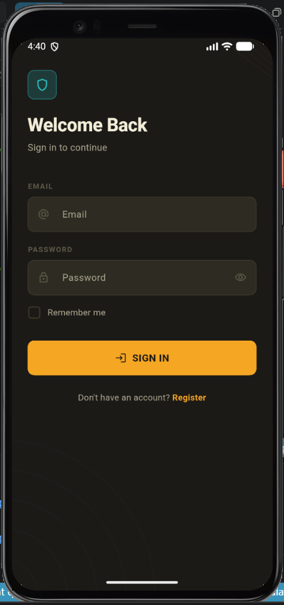
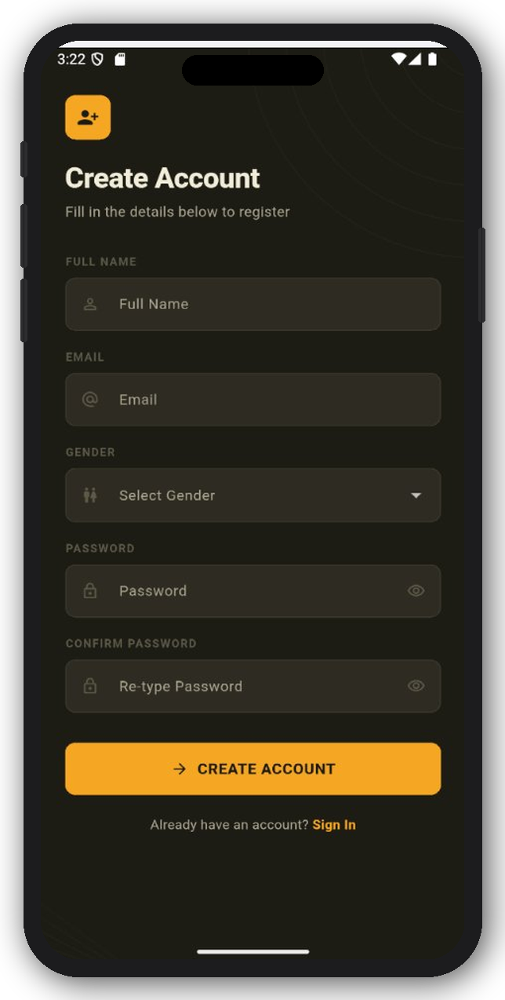
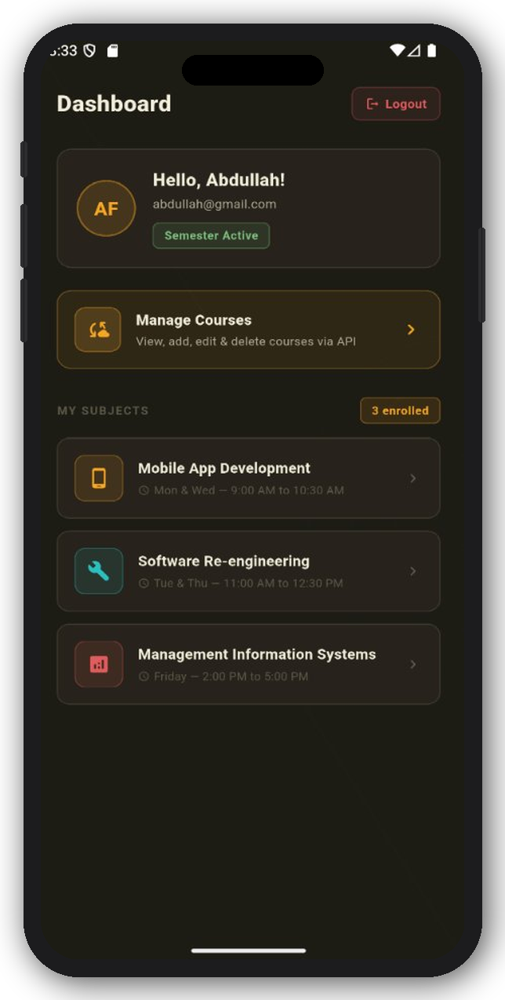
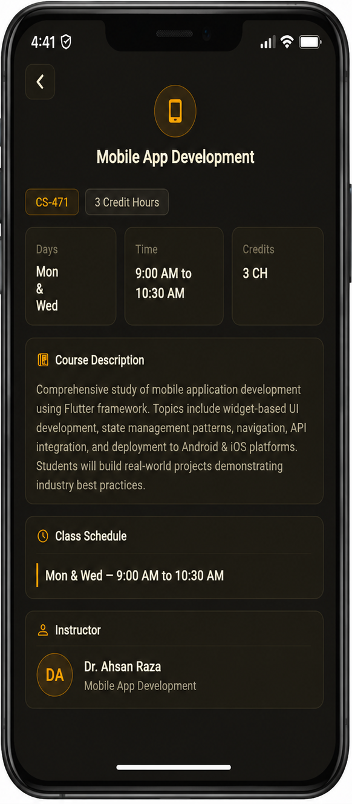

# 📱 Flutter Multi Screen App

## 👨‍💻 Student Information
- Name: Abdullah Faisal
- Student_ID: SE 221070
  
## 📌 Overview
This is a modern Flutter-based Academic Management App designed for students to manage and view their academic subjects in a clean and structured interface. The application includes authentication, dashboard, and detailed subject views with a premium dark UI design.

The project is built using Flutter with Provider for state management and follows a modular and scalable architecture.

---

## 🚀 Features

- 🔐 User Registration & Login System  
- 👤 Gender Selection with Validation  
- 📊 Dynamic Dashboard with Subject List  
- 📖 Detailed Subject Information Screen  
- 🎨 Modern Dark Theme UI Design  
- ⚡ Smooth Animations & Transitions  
- 🧠 Form Validation (Email, Password, Name, etc.)  
- 💾 Remember Me Functionality (Local Storage)  
- 🧩 Reusable Custom Widgets (Buttons, Inputs, Cards)  
- 📱 Fully Responsive Mobile UI  

---

## 🛠️ Tech Stack

- Flutter (Dart)
- Provider (State Management)
- Shared Preferences (Local Storage)
- Material Design Components

---

## 📂 Project Structure

## 📸 Screenshots

### 🔐 Login Screen

### 📝 Registration Screen

### 📊 Dashboard Screen

### 📖 Subject Detail Screen

